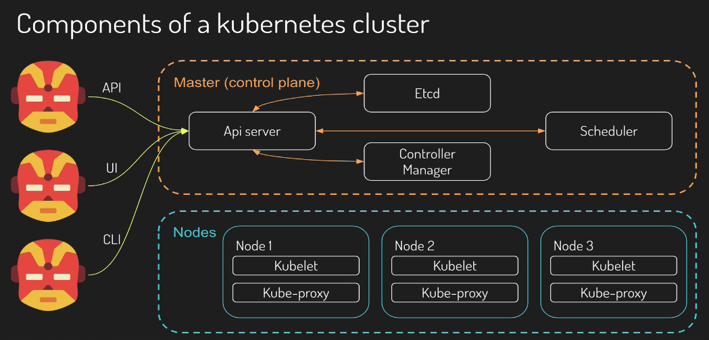
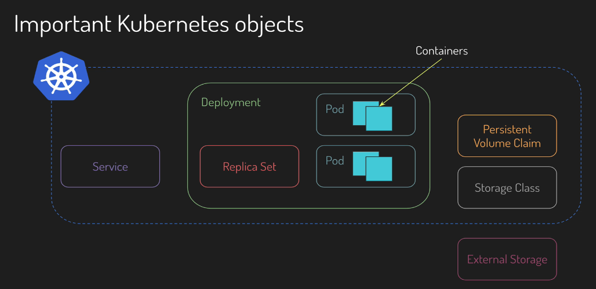
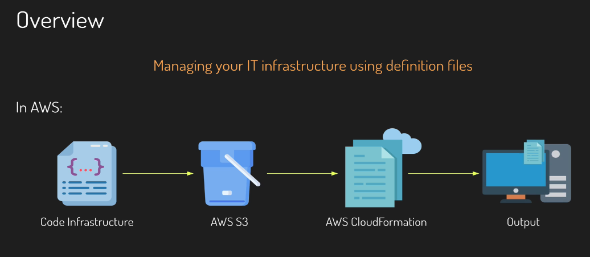
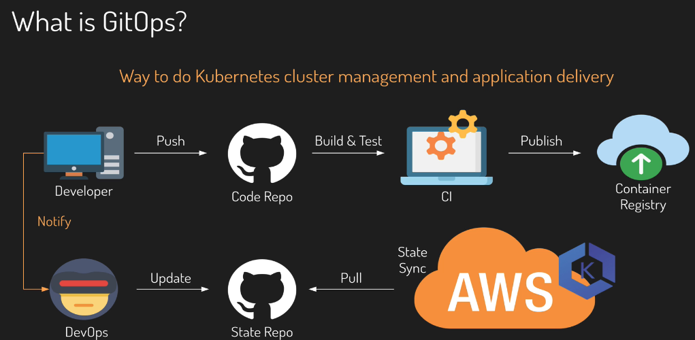
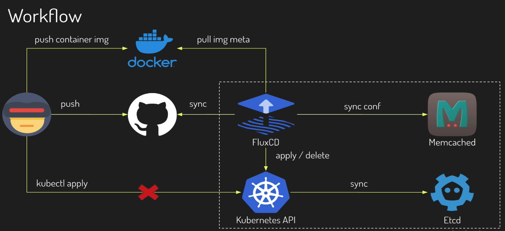

# Exploring the DevOps World

### What is DevOps?

- Continuous Management
- Continuous Integration
- Automated Testing
- Infrastructure as Code
- Continuous Delivery
- Continuous Monitoring

### Kubernetes

**What is Kubernetes?**

- Open source project by Google in 2014
- Container orchestrator
- Automates sysadmin tasks
- Goal: Always match the desired state

**Kubernetes is Powerful…**

- Zero downtime deployments
- Provides facilities to implement CD practices
- Supports auto scaling (up and down)
- Redundancy and failover built-in
- and more…

**Components of a Kubernetes Cluster**

- **Master (control plane)**
    - **API Server**: the front end server for the control plane handling API requests coming from the UI, CLI, or any HTTP requests.
    - **Scheduler**: decides where to run newly created pods.
    - **Controller Manager**: running resource controllers like deployments.
    - **Etcd**: a database where Kubernetes stores all of its information, such as which node is available, what resources exist on the cluster, and so on.
- **Nodes**
    - **Node**
        - **Kubelet**: driving the container runtime to start workloads that are scheduled on the node and monitoring the status
        - **Kube-proxy**: routing requests between pods on different nodes, and between pods and the Internet.

### Kubernetes Objects

- **Pod**: Group of on or more containers with shared network/storage and a spec for how to run.
- **ReplicaSet**: Ensures that s specified number of pod replicas are running at any given time.
- **Deployment**: Describes a desired state and a deployment controller ensures that the state is maintained.
- **Service**: Defines a logical set of pods and a policy by which to access them.
- **Storage Class**: Provides a way to describe “class” of storage. Represents a persistent volume.
- **Persistent Volume Claim**: Abstractions of persistent volumes. A persistent volume is a piece of storage in the cluster.

### IaC (Infrastructure as Code)

- Benefits
    - Speed
    - Consistency
    - Accountability

### GitOps

- Benefits
    - Increased Productivity
    - Enhanced Developer Experience
    - Improved Stability
    - Higher Reliability
    - Consistency and Standardization
    - Stronger Security Guarantees
- IaC vs. GitOps
    
    
    | **IaC** | **GitOps** |
    | --- | --- |
    | Agnostic | Git |
    | Infrastructure Only | The Whole Cloud Stack |
    - Use GitOps with an IaC tool like Terraform!

### Flux

- Ensures that the cluster config matches the one in Git and automate your deployments.
- A tool that automatically detects changes in the state repo.
- Checks if they’re operational and triggers updated deployments inside your Kubernetes Cluster.
- Declarative, Automated, Code

