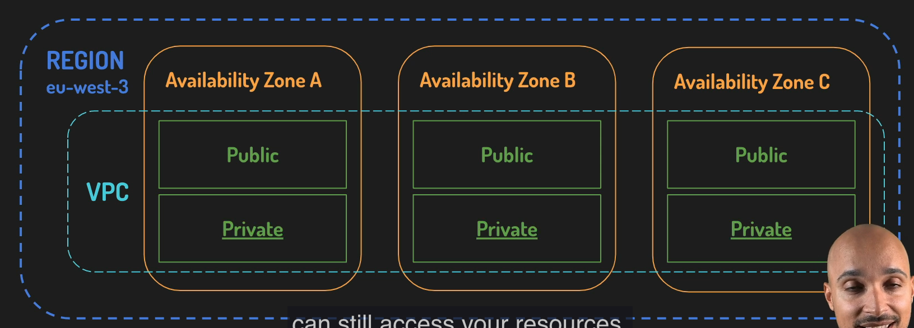
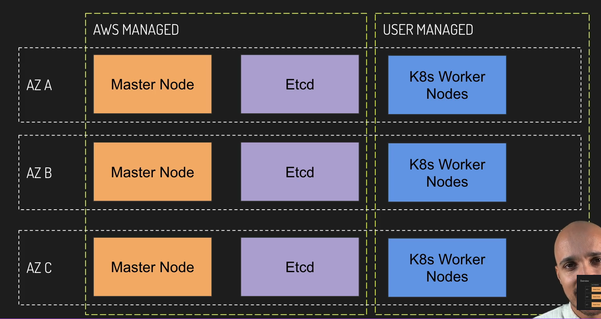
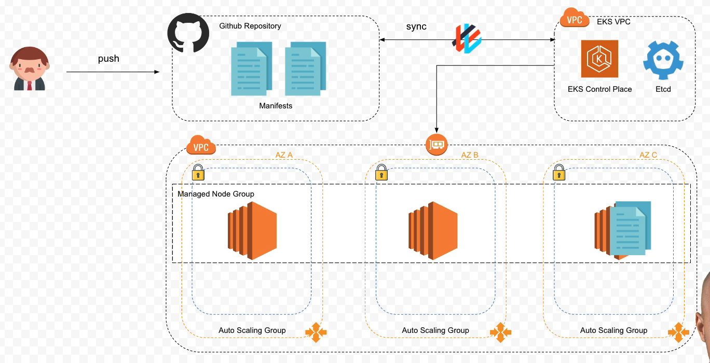
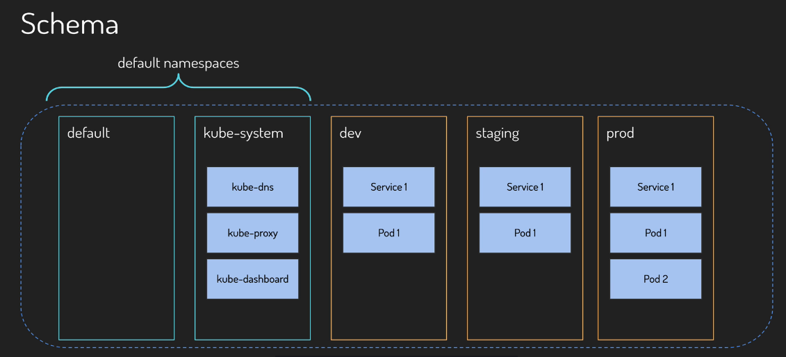

# Theory

### AZs, VPCs, and Subnets in AWS

- **Region**: A physical location of a data center (`asia-northest2`)
- **AZ (Availability Zone)**: Group of logical data centers (`Availability Zone A`, `Availability Zone B`, `Availability Zone C`)
- **VPC (Virtual Private Network)**: Resources within the same VPC can communicate with each other, but cannot reach resources in another VPC unless you explicitly allow it
    - VPC can span multiple **AZs** within a single **Region**, which means you can have the same VPC covering multiple **AZs**.
- **Subnet**: **VPC** can also be divided into smaller network segments called Subnet.
    - A Subnet allows you to apply different access rules and place resources in different containers where those rules apply.



### What is AWS EKS?

- EKS = `Elastic Kubernetes Service`
- Makes easy to deploy, manage, and scale containerized applications.
- Orchestrate your containers.
- Still need to configure VPCs, Subnets, IAM roles, SSH Keys, …
- Integrated with AWS services (ECR, ELB, IAM)



- EKS Manages the **Control Plane** instances across AZs, and detects and replaces the unhealthy **Control Plane** instances for you.

### EKS Architecture Overview

- This architecture has two VPCs.
    - **VPC 1**: Control Plane and Etcd (EKS manages that for you.)
    - **VPC 2**: Worker Nodes (You directly manages that.)



### Namespaces in Kubernetes

- Kubernetes namespaces help to virtually divide a kubernetes cluster.



# Practice

### AWS CLI 설치 (aws configure를 완료하면, ~/.aws에 액세스 정보 저장됨!)
```bash
brew install awscli
aws --version
aws configure
aws sts get-caller-identity
```

### Python virtual environment 생성 및 활성화
```bash
python -m venv .sandbox
source .sandbox/bin/activate
```

### EKS CTL 설치
```bash
brew install eksctl
eksctl version
```

### Kube CTL 설치
```bash
brew install kubectl
kubectl version --client
```

### Helm Chart 설치
```bash
brew install helm
helm version --short
```

### Helm Chart Stable Repo 추가
```bash
helm repo add stable https://charts.helm.sh/stable
helm repo list
```

### 기타 설치
```bash
brew install jq gettext bash-completion moreutils
```

### AWS Identity 환경 변수화
```bash
export ACCOUNT_ID=$(aws sts get-caller-identity --query Account --output text)
export AWS_REGION=ap-northeast-2
echo $ACCOUNT_ID
echo $AWS_REGION
echo "export ACCOUNT_ID=${ACCOUNT_ID}" >> ~/.zshrc
echo "export AWS_REGION=${AWS_REGION}" >> ~/.zshrc
aws configure set default.region ${AWS_REGION}
aws configure get default.region
```

### SSH Key 생성
```bash
ssh-keygen -t rsa -C "aws" -f ~/.ssh/aws
cat ~/.ssh/aws.pub # Add this Public Key onto My GitHub SSH Keys.
```

### AWS EC2에 Key Pair 등록
```bash
aws ec2 import-key-pair --key-name "airflow" --public-key-material fileb://~/.ssh/aws.pub
# https://ap-northeast-2.console.aws.amazon.com/ec2/home?region=ap-northeast-2#KeyPairs: 에서 생성 확인 가능
```

### AWS IAM Authenticator 설치
```bash
brew install aws-iam-authenticator
aws-iam-authenticator help
```

### EKS 클러스터 생성 (15분 정도 소요)
```bash
eksctl create cluster -f cluster-config.yml
```

### 클러스터 상태 확인
```bash
kubectl get nodes
kubectl get pods --all-namespaces
```

### FluxCD 설치
```bash
brew install fluxcd/tap/flux
flux --version
```

### GitHub PAT (classic) 생성하기
```plain
https://github.com/settings/tokens/new
```
- **Note**: airflow-on-aws-eks
- **Expiration**: 30 Days
- **Select scopes**: `Repo` Only

### GitHub PAT 환경변수 등록하기
```bash
export GITHUB_TOKEN="GitHub PAT"
echo $GITHUB_TOKEN
```

### Flux GitHub 연동 설정하기
```bash
flux bootstrap github \
  --owner=joshua-data \
  --repository=study-course-airflow-on-aws-eks-config \
  --branch=main \
  --interval=15s \
  --personal
```

### `study-course-airflow-on-aws-eks-config` Repo에서 변동사항 확인하기

- flux-system 디렉토리 생성 확인
```plain
https://github.com/joshua-data/study-course-airflow-on-aws-eks-config
```

- Deploy key 생성 확인 (Repo와 EKS Cluster의 상태 싱크업을 위해 사용함)
```plain
https://github.com/joshua-data/study-course-airflow-on-aws-eks-config/settings/keys
```

### `aws-eks-config` Repo 로컬에 클론하기
```bash
git clone https://github.com/joshua-data/study-course-airflow-on-aws-eks-config.git
```

### `aws-eks-config` Repo에 디렉토리 생성하기
```bash
mkdir -p {workloads,releases,namespaces}
ls -al
```

### 각 디렉토리마다 .keep 파일 생성하기 (빈 디렉토리도 Git에서 추적하도록 하기 위함)
```bash
find . -type d -exec touch {}/.keep \;
```

### Remote Repo에 Push하기
```bash
git add .
git commit -m "directory structure"
git push -u origin main
```

### 현재 EKS Namespaces 목록 확인하기
```bash
kubectl get namespaces
```

### Namespace yaml 파일들(dev, staging, prod)을 `aws-eks-config/namespaces/`에 생성해주기

- `dev.yml`
```yaml
apiVersion: v1
kind: Namespace
metadata:
  labels:
    name: dev
  name: dev
```

- `staging.yml`
```yaml
apiVersion: v1
kind: Namespace
metadata:
  labels:
    name: staging
  name: staging
```

- `prod.yml`
```yaml
apiVersion: v1
kind: Namespace
metadata:
  labels:
    name: prod
  name: prod
```

### Remote Repo에 Push해서 Flux가 EKS Cluster에 Sync하도록 해주기
```bash
git add .
git commit -m "added:added namespaces"
git push -u origin main
```

### 몇 초 후, Namespaces가 EKS Cluster에 잘 생성되었는지 확인하기
```bash
kubectl get namespaces
```

- 또는, AWS Console에서 직접 확인할 수도 있음
```plain
https://ap-northeast-2.console.aws.amazon.com/eks/clusters/airflow?region=ap-northeast-2&selectedResourceId=namespaces&selectedTab=cluster-resources-tab
```
