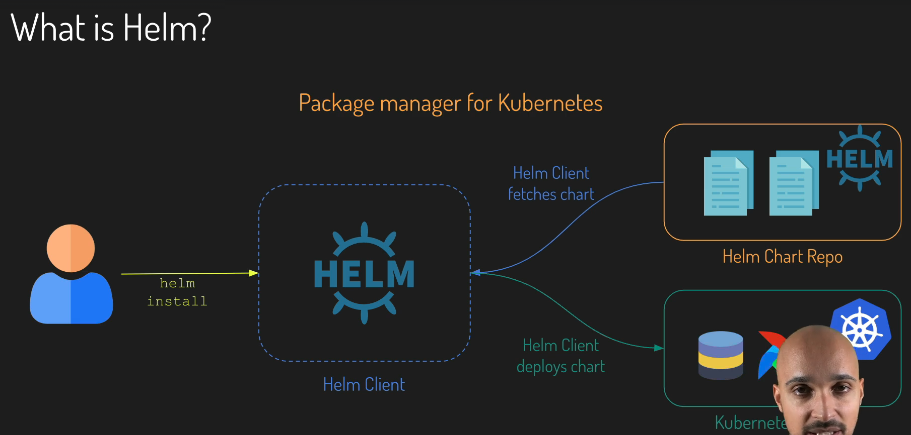
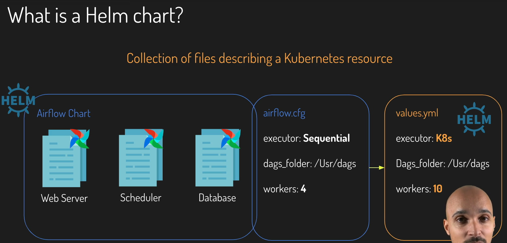
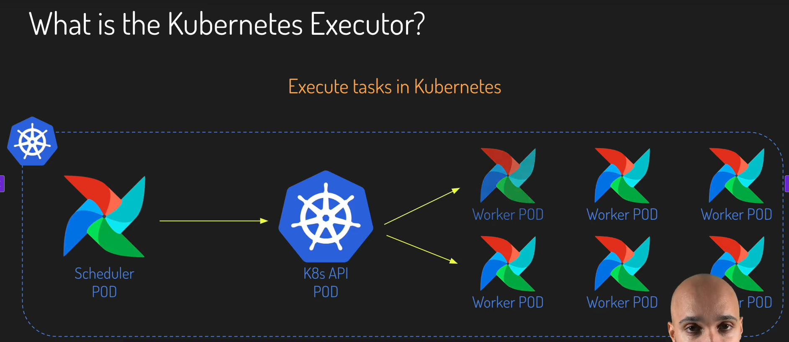
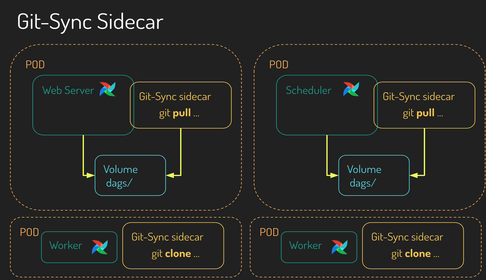
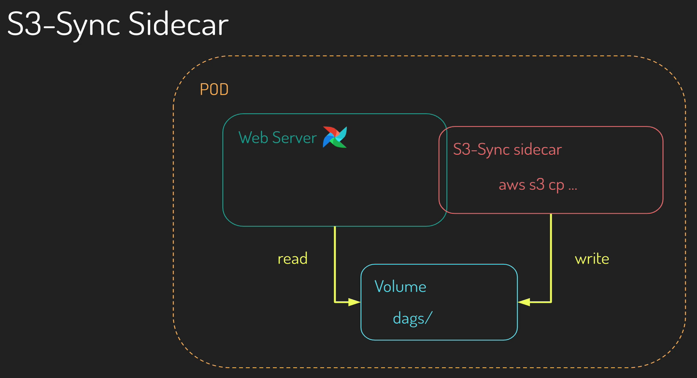
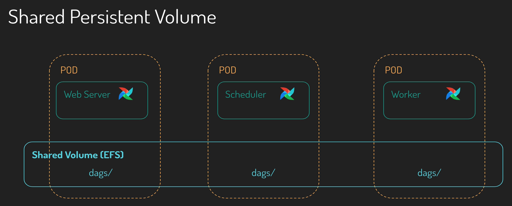
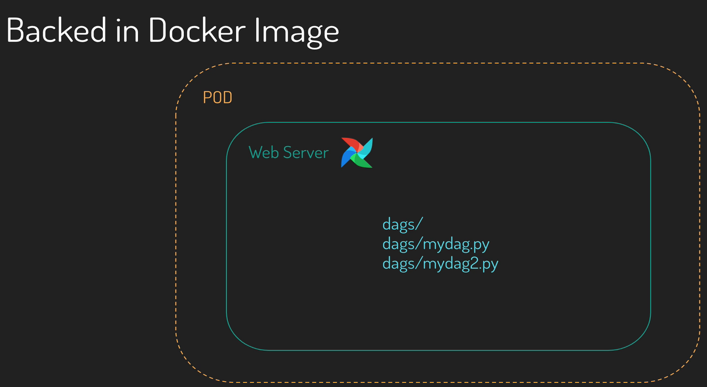
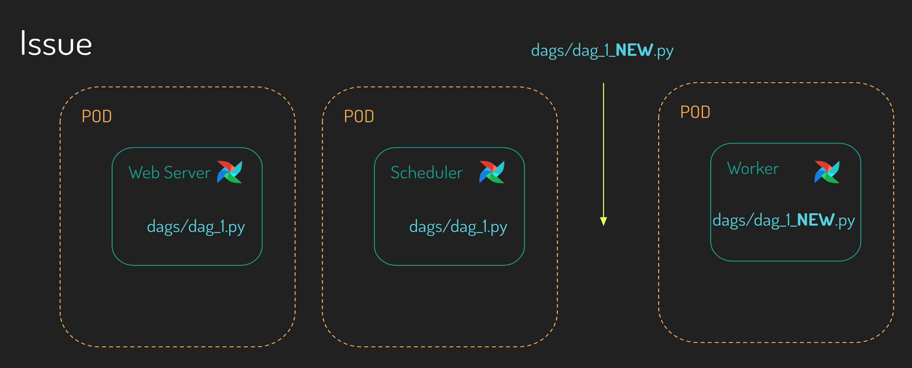

# Theory

### What’s Helm?

- **Helm**: Package manager for Kubernetes
- **Helm Client**: The CLI to interact with Helm and your Kubernetes cluster
- **Helm Chart**: The Application in Helm



### What is a Helm Chart?

- **Helm Chart**: Collection of files (manifests) describing a Kubernetes resource that your application needs to run
    - **Manifest**: a YAML file that contains the declarative configuration of a Kubernetes resource that you want to deploy
- With Helm, you are **NOT** going to change `airflow.cfg`. Instead, You are going to use `values.yml`.
    - **`values.yml`**: You describe the configuration settings that you want to change, and you will use that to configure your helm chart.



### What is Kubernetes Executor

- **Executor**: Executes tasks in Kubernetes
    - You always have **one task, one pod**.
    - As soon as one of the tasks in done, the Kubernetes API **terminates that pod**.
- **Benefits**
    - Dynamic allocation
    - Avoid wasting resources
    - Task level pod configuration
    - Fault tolerance: if a pod fails, then it does NOT impact the OS of pods in your airflow instance.
- **Drawbacks**
    - Learning curve of Kubernetes
    - Expensive with thousands of small tasks to execute
    - Non-zero startup time: each time Kubernetes creates a new pod, there’s a little bit of overhead to install airflow and dependencies.



### Synchronizing DAGs in Kubernetes

<aside>


이 설명은 **Airflow를 Kubernetes 환경에서 KubernetesExecutor로 실행할 때, DAG 파일들을 어떻게 각 Pod 간에 동기화(synchronize)할 것인가**에 대한 이야기예요.

</aside>

**💡 핵심 개념 먼저**

- Airflow를 Kubernetes 위에서 실행할 때, 각 컴포넌트(예: webserver, scheduler, worker)는 **서로 다른 Pod**에서 돌아갑니다.
- 각 Pod는 **자신만의 Docker 컨테이너 환경**이기 때문에, `dags/` 폴더가 서로 다른 상태일 수 있습니다.
- 만약 DAG이 업데이트되면, **모든 Pod에 똑같이 반영되지 않으면** 실행 결과가 뒤죽박죽이 될 수 있어요.
    - 예: scheduler는 옛날 DAG을 실행하려 하고, worker는 최신 DAG으로 실행 → **태스크 충돌, 에러, 데이터 손상**

**✅ 해결책 요약: DAG 동기화 방식 4가지**

| 방법 | 설명 | 장점 | 단점 |
| --- | --- | --- | --- |
| 1. Git Sync Sidecar | Git repo를 주기적으로 pull하는 컨테이너를 webserver/scheduler와 같은 Pod에 추가 | 간편한 Git 관리, CI/CD와 연동 쉬움 | Git 저장소 의존, worker는 1회만 clone |
| 2. S3 Sidecar | S3 버킷에서 DAG을 주기적으로 가져오는 방식 | 권한 제어 우수, 팀 단위 운영에 유리 | S3 연동 설정 필요 |
| 3. Shared Persistent Volume (예: EFS) | 여러 Pod가 하나의 디스크를 공유하여 같은 DAG을 참조 | 실시간 동기화, 단일 소스 관리 | EFS 같은 NFS 필요, 락 이슈 등 |
| 4. Docker Image에 DAG 포함 | Airflow Docker 이미지에 DAG을 복사해서 이미지로 배포 | 완전 독립적, 종속성 함께 패키징 | DAG 변경 시마다 새 이미지 빌드 + Pod 재시작 필요 |









**📍 실제 잘못된 상황 예시**



- webserver와 scheduler는 `dag_1.py (v1)`을 갖고 있음
- worker는 `dag_1.py (v2)`로 실행됨
- → 서로 다른 DAG 버전 → task 실패, 로그 불일치 등

**🎯 어떤 방법을 써야 하나요?**

| 상황 | 추천 방식 |
| --- | --- |
| 혼자 개발, 소규모 테스트 | Docker 이미지에 DAG 포함 (간단) |
| CI/CD로 DAG 자동 배포 원함 | Git Sync Sidecar 방식 |
| 다수의 팀, 데이터 거버넌스 중요 | S3 + IAM 접근 제어 |
| 실시간 DAG 배포 + 실시간 반영 | Shared EFS volume |

**✅ 요약 정리**

> Kubernetes에서 Airflow는 컴포넌트가 Pod로 분리되어 돌아가기 때문에, DAG 파일을 어떻게 공유하고 동기화할지가 매우 중요합니다.
> 

**동기화 방식 4가지:**

1. Git Sync Sidecar
2. S3 Sidecar
3. Shared Persistent Volume
4. Docker 이미지 내 포함

DAG을 어떻게 업데이트하고 배포할지 전략을 잘 세워야, 스케줄러, 웹서버, 워커 간 DAG 불일치 문제를 방지할 수 있어요.

### Secrets in Kubernetes

**🔐 1. 왜 Secrets가 필요한가요?**

✅ 긍정적 관점

- 민감한 정보를 **안전하게 관리**하기 위해서입니다.
- 예를 들어, 비밀번호, 토큰, SSH 키 등은 코드나 이미지에 **그대로 저장하면 위험**합니다.
- Kubernetes는 이러한 민감 정보를 **노출되지 않게** 관리할 수 있도록 `Secrets`라는 기능을 제공합니다.

❌ 부정적 관점

- 만약 Secrets를 사용하지 않고 민감 정보를 직접 저장하면, 도커 이미지나 깃 저장소에 노출될 수 있습니다.
    
    → 보안 위협(예: 해킹, 정보 유출) 가능성이 커집니다.
    

**📦 2. Kubernetes에서 Secrets란?**

- `Secret`은 Kubernetes 객체(Object)입니다.
- 민감한 정보를 **암호화된 형태로 저장**하고, **필요한 컨테이너에서만 접근**할 수 있도록 해줍니다.
- 데이터를 직접 보이지 않게 하여 보안 리스크를 줄입니다.

**🛠️ 3. Secrets 사용하는 방법 3가지**

Kubernetes에서는 Secret을 아래 3가지 방식으로 사용할 수 있어요:

| 방법 | 설명 | 장점 | 단점 |
| --- | --- | --- | --- |
| 1. **Volume으로 마운트** | 파일처럼 pod에 마운트 | 안전함, 동적으로 업데이트 가능 | 조금 복잡 |
| 2. **환경 변수(Environment Variables)** | 컨테이너 내부에서 변수로 사용 | 간단, 익숙한 방법 | 보안에 더 취약 |
| 3. **이미지 풀링 시 인증** | 비공개 이미지 레지스트리 접근 | CI/CD 환경에서 유용 | 특수한 상황에만 사용 |

**🧪 4. 예시: 비공개 Git 저장소에서 DAG 가져오기**

상황

- Git 저장소에서 DAG를 가져오고 싶음
- 저장소는 **비공개**이므로 SSH 키 필요
- **비공개 키는 안전하게 저장**되어야 함

✅ 방법 1: **Volume 마운트 방식 (권장)**

1. **SSH 키 생성** (public/private 쌍)
2. public key는 Git 저장소에 등록
3. private key는 Kubernetes `Secret` 객체로 저장
4. `Deployment`에 다음 내용 추가:
    - `volume` 정의 (Secret 이름 사용)
    - 해당 volume을 특정 경로로 마운트
5. Pod가 시작되면 private key가 지정된 경로에 **파일처럼 존재**
6. 애플리케이션은 해당 경로에서 key를 읽고 Git 저장소에 접근

> 👍 이 방법이 더 안전하고, 나중에 Secret 값을 업데이트해도 적용 가능합니다.
> 

✅ 방법 2: **환경 변수 방식**

1. private key를 포함한 `Secret` 생성
2. `Deployment`에서 환경 변수 정의
    - 예: `GIT_KEY` 환경변수 = Secret에서 가져온 값
3. Pod가 시작되면 환경 변수로 키를 읽음
4. 애플리케이션은 이 환경 변수를 이용해 Git에 접근

> ⚠️ 이 방법은 노출 위험이 조금 더 높습니다.
> 

**✅ 5. Best Practice 요약**

| 항목 | 권장도 | 이유 |
| --- | --- | --- |
| Volume으로 사용하는 방법 | ⭐️⭐️⭐️⭐️⭐️ (추천) | 보안성 높고, 동적 업데이트 가능 |
| 환경 변수 방식 | ⭐️⭐️ (주의) | 변수 노출 가능성 존재, 업데이트 어려움 |
| Secret을 코드/이미지에 직접 저장 | ❌ (금지) | 매우 위험함, 절대 금지 |

# Practice

### Airflow Helm Chart 공식 웹사이트 접속하기

```
https://airflow.apache.org/docs/helm-chart/stable/index.html
```

### Airflow Helm Chart 공식 Repo 접속하기

```
https://github.com/apache/airflow/tree/main/chart
```

- `Chart.yaml` 주의사항
    - `version`: Helm Chart 버전을 의미함
    - `appVersion`: Airflow 버전을 의미함

```yaml
apiVersion: v2
name: airflow
version: 1.18.0
appVersion: 3.0.2
```

- `templates/`
    - Helm이 애플리케이션을 배포할 때, 실제로 Templated Files를 렌더링함
    - `templates` 폴더 내에는 실제로 배포되는 Airflow Components들이 생성되어 있음
- [webserver-deployment.yaml](https://github.com/apache/airflow/blob/main/chart/templates/webserver/webserver-deployment.yaml) 사례
    - **Deployment**: 배포되는 Kubernetes Object
        
        ```yaml
        apiVersion: apps/v1
        kind: Deployment
        ```
        
    - **`{{ include "airflow.fullname" . }}`**: 런타임에서 Helm이 Helm Chart를 설치할 때, 이 Value가 자동으로 변환됨 (from `Chart.yaml`)
        
        ```yaml
        ...
        metadata:
          name: {{ include "airflow.fullname" . }}-webserver
        ```
        
    - **`{{ .Values.webserver.replicas }}`**: 런타임에서 Helm이 Helm Chart를 설치할 때, 이 Value가 자동으로 변환됨 (from `values.yaml`)
        
        ```yaml
        spec:
          ...
          replicas: {{ .Values.webserver.replicas }}
        ```
        

### 총정리

| 파일명 | 주요 역할 | 예시 |
| --- | --- | --- |
| `Chart.yaml` | Helm Chart 메타 정보 (이름, 버전, 의존성 등) | `name: airflow`, `version: 1.12.0` |
| `values.yaml` | 사용자 정의 설정값 입력 (변수 값 정의) | `replicaCount: 2`, `executor: CeleryExecutor` |
| `templates/` | 쿠버네티스 리소스 템플릿(YAML) 위치 (여기서 실제 배포 파일 생성됨) | `deployment.yaml`, `configmap.yaml`, `webserver.yaml` 등 |

| 항목 | `Chart.yaml` | `values.yaml` | `templates/*.yaml` |
| --- | --- | --- | --- |
| 정의 내용 | Chart의 메타정보 | 설정값 (변수 정의) | 실제 Kubernetes 리소스 템플릿 |
| 사용자 편집 여부 | 거의 안 건드림 | 주로 수정함 | 보통 Chart 개발자가 작성 |
| 참조 방식 | `.Chart.<field>` | `.Values.<field>` | Go 템플릿 문법 사용 |
| 예시 사용법 | `{{ .Chart.Name }}` | `{{ .Values.executor }}` | Helm 템플릿에서 둘 다 가능 |

### Amazon EBS(Elastic Block Store) Driver 설치하기 (상황 요약)

> "Airflow를 EKS에 띄우기 위해 Amazon EBS CSI Driver를 Helm Repo로 추가해야 한다."
> 

단계별로 나누면:

1. **Airflow는 Persistent Volume (볼륨 저장소)** 가 필요해요.
2. **EKS에서 PersistentVolumeClaim (PVC)** 을 사용하려면 실제 스토리지 드라이버가 필요해요.
3. EBS를 쓰려면 **Amazon EBS CSI Driver**라는 컨트롤러가 클러스터에 설치되어 있어야 해요.
4. 그래서 **Helm에 EBS CSI Driver 설치 정보를 Repo로 추가**하는 거예요.

### Amazon EBS(Elastic Block Store) Driver 설치하기 (핵심 개념 정리)

| 용어 | 역할 | 비유 |
| --- | --- | --- |
| **EBS (Elastic Block Store)** | AWS에서 제공하는 저장소 (디스크) | 컴퓨터 하드디스크 |
| **CSI Driver (Container Storage Interface)** | 쿠버네티스와 EBS 사이에서 “스토리지를 연결”해주는 플러그인 | 하드디스크를 컴퓨터에 연결해주는 USB |
| **Airflow on EKS** | Airflow 실행 시 로그, DB, 파일 등 저장을 위해 PVC 필요 | 웹서비스가 데이터를 저장할 공간 필요 |
| **PVC (PersistentVolumeClaim)** | 쿠버네티스 앱이 요청하는 저장소 | “나 10GB짜리 디스크 하나 주세요!” |

### `aws-ebs-csi-driver` Helm Repo 추가하기 ([참고](https://github.com/kubernetes-sigs/aws-ebs-csi-driver/blob/master/docs/install.md))

```bash
helm repo add aws-ebs-csi-driver https://kubernetes-sigs.github.io/aws-ebs-csi-driver
helm repo update
```

### 이제 추가된 Helm Chart를 통해 드라이버 설치하기

```bash
helm upgrade --install aws-ebs-csi-driver \
  --namespace kube-system \
  aws-ebs-csi-driver/aws-ebs-csi-driver
```

### 드라이버가 잘 설치되었는지 확인하기

```bash
kubectl get pod -n kube-system -l "app.kubernetes.io/name=aws-ebs-csi-driver,app.kubernetes.io/instance=aws-ebs-csi-driver"
```

### StorageClass(`gp2`) Default로 세팅하기

```bash
kubectl patch storageclass gp2 -p '{"metadata": {"annotations":{"[storageclass.kubernetes.io/is-default-class":"true](http://storageclass.kubernetes.io/is-default-class%22:%22true)"}
```

### HelmRepository 세팅하기

- 이미 Chart.yaml + values.yaml을 통해 templates을 생성할 수 있는데, Helm Repo를 세팅해야 하는 이유가 뭐지? (내 궁금증)

| 목적 | 관련 파일 | 설명 |
| --- | --- | --- |
| ✅ **Helm 차트를 만드는 쪽** | `Chart.yaml`, `values.yaml`, `templates/` | 내가 직접 새로운 Helm 차트를 개발 (ex. Airflow용 차트를 직접 만드는 경우) |
| ✅ **Helm 차트를 사용하는 쪽** | `HelmRepository`, `HelmRelease` | 다른 사람이 만든 Helm 차트를 "설치"하고 관리 (ex. Apache Airflow 공식 차트) |
- `sources/airflow-repo.yml` 파일을 `study-course-airflow-on-aws-eks-config` Repo에 추가해주기
    
    ```bash
    git add .
    git commit -m "added:added helm repo"
    git push -u origin main
    
    ```
    
- 이제, Flux가 자동으로 Kubernetes cluster에 동일한 Airflow Repo Object를 생성해주게 됨
- 1분 정도 후, Flux가 배포하는 모든 리소스 목록을 확인해보기
    
    ```bash
    flux get all
    ```
    

### HelmRelease 세팅하기

- Helm Repo와 Helm Release는 어떤 차이가 있는 거지?
    
    
    | 개념 | 설명 |
    | --- | --- |
    | **HelmRepository** | “어디서” Helm Chart를 가져올지 정의 |
    | **HelmRelease** | “무엇을” 설치할지 + “어떻게” 설치할지 정의 |
- `releases/airflow-dev.yml` 파일을 `study-course-airflow-on-aws-eks-config` Repo에 추가해주기
    - `airflow-dev.yml`
        
        ```yaml
        apiVersion: helm.toolkit.fluxcd.io/v2beta1
        kind: HelmRelease
        metadata:
          name: airflow
          namespace: dev
        spec:
          interval: 5m  # 30s → 5m으로 증가 (너무 빈번한 체크 방지)
          timeout: 15m  # 타임아웃 15분 추가
          releaseName: airflow-dev
          chart:
            spec:
              chart: airflow
              version: "1.17.0"
              sourceRef:
                kind: HelmRepository
                name: apache-airflow
                namespace: flux-system
          # 설치/업그레이드 정책 추가 (필수)
          install:
            timeout: 15m
            remediation:
              retries: 3
          upgrade:
            timeout: 15m
            remediation:
              retries: 3
              remediateLastFailure: true
          rollback:
            timeout: 15m
            cleanupOnFail: true
            force: true
          values:
            defaultAirflowTag: "3.0.2"
            airflowVersion: "3.0.2"
            fernetKey: "zTxhk7FuGqQVPZVoukLn5bGWOrgHzhQnBnaqAItcZGI="
            env:
              - name: "AIRFLOW__CORE__LOAD_EXAMPLES"
                value: "False"
              - name: "AIRFLOW__KUBERNETES_EXECUTOR__NAMESPACE"
                value: "dev"
              - name: "AIRFLOW__KUBERNETES_EXECUTOR__WORKER_CONTAINER_REPOSITORY"
                value: "apache/airflow"
              - name: "AIRFLOW__KUBERNETES_EXECUTOR__WORKER_CONTAINER_TAG"
                value: "slim-3.0.2-python3.10"
            executor: "KubernetesExecutor"
            createUserJob:
              useHelmHooks: false
            migrateDatabaseJob:
              useHelmHooks: false
            
            # PostgreSQL 설정 추가 (필수 - 없으면 배포 실패)
            postgresql:
              enabled: true
              persistence:
                enabled: true
                storageClass: ""  # 기본 StorageClass 사용
                size: 8Gi
              resources:
                limits:
                  memory: 1Gi
                  cpu: 500m
                requests:
                  memory: 256Mi
                  cpu: 100m
            
            # Redis 설정 추가 (필수 - 없으면 배포 실패)
            redis:
              enabled: true
              resources:
                limits:
                  memory: 512Mi
                  cpu: 500m
                requests:
                  memory: 128Mi
                  cpu: 100m
            
            # 웹서버 리소스 제한 (권장)
            webserver:
              resources:
                limits:
                  memory: 1Gi
                  cpu: 500m
                requests:
                  memory: 512Mi
                  cpu: 100m
            
            # 스케줄러 리소스 제한 (권장)
            scheduler:
              resources:
                limits:
                  memory: 1Gi
                  cpu: 500m
                requests:
                  memory: 512Mi
                  cpu: 100m
        
            # DAGs: gitSync 전략
            dags:
              persistence:
                enabled: False   # DAG을 Git으로만 가져오고, PVC 사용 안함
              gitSync:
                enabled: True    # git-sync sidecar 활성화
                repo: https://github.com/joshua-data/study-course-airflow-on-aws-dags.git
                branch: main     # 어떤 브랜치를 pull할 건지
                maxFailures: 0   # 실패 시 몇 번까지 재시도
                subPath: "sources"  # repo 내부의 서브디렉토리 (예: sources 폴더 내만 mount)
                wait: 60         # pull 간격 (초)
        ```
        
    - version 정보는 [이 Repo](https://github.com/apache/airflow/blob/main/chart/values.yaml)를 참고하여 업데이트해줄 수 있음
    - Chart Version과 Airflow Version의 Pair는 아래 명령어를 통해 찾을 수 있음
    
    ```bash
    helm search repo apache-airflow/airflow --versions
    ```
    
    ```bash
    git add .
    git commit -m "added:added helm release (dev)"
    git push -u origin main
    ```
    

### 이제 Flux를 통해 Airflow가 배포되었는지 확인해보기

```bash
flux logs --follow --level=error --all-namespaces
kubectl get pods -n dev
```

### airflow-dags Repo 생성하기

- 이미 생성했음 (https://github.com/joshua-data/study-course-airflow-on-aws-dags)

### `releases/airflow-dev.yml` 파일 하단에 DAGs 정보 적어주기 (Git-Sync Sidecar 방법으로 Synchronizing DAGs 할 것임!)

```yaml
# releases/airflow-dev.yml
    dags:
      persistence:
        enabled: False   # DAG을 Git으로만 가져오고, PVC 사용 안함
      gitSync:
        enabled: True    # git-sync sidecar 활성화
        repo: https://github.com/joshua-data/study-course-airflow-on-aws-dags.git
        branch: main     # 어떤 브랜치를 pull할 건지
        maxFailures: 0   # 실패 시 몇 번까지 재시도
        subPath: "sources/"  # repo 내부의 서브디렉토리 (예: sources 폴더 내만 mount)
        wait: 60         # pull 간격 (초)
```

```bash
git add .
git commit -m "added:git-sync sidecar config to synchronize DAGs"
git push -u origin main
```

### Triggerer Pod에서 컨테이터 목록 중 `git-sync`가 나타났는지 확인하기

```bash
kubectl describe pod airflow-dev-triggerer-0 -n dev
```

### 마지막으로 다음과 같이, DAG 목록이 잘 동기화되었는지 확인해보기

```bash
kubectl exec -it airflow-dev-scheduler-76888b6fbd-jrqff -n dev -c scheduler -- /bin/bash
airflow@airflow-dev-scheduler-76888b6fbd-jrqff:/opt/airflow$ airflow dags list
```

### Private Airflow DAGs Repo에 접근하기 위해, 우선 로컬에서 SSH Key 생성 후 복사하기

- 주의: SSH Key 생성할 때 Passphrase는 절대로 입력하지 말 것 (Pod 상에 올려야 하기 때문)

```bash
ssh-keygen -t rsa -C “private-dags-repo” -f ~/.ssh/private-dags-repo
vi ~/.ssh/private-dags-repo.pub
```

### [Private Airflow DAGs Repo](https://github.com/joshua-data/study-course-airflow-on-aws-dags)에 접속하여, Settings > Deploy keys에 추가하기

- **airflow-on-eks** 이름으로 `private-dags-repo.pub` 저장 (Allow write access 체크)

### [EKS Config Repo](https://github.com/joshua-data/study-course-airflow-on-aws-eks-config)의 Visibility를 Private으로 바꿔주기

- 곧, Repo에 Private Key를 삽입할 것이기 때문임

### 생성한 Private Key를 Base64로 인코딩하여 `tmp.txt`에 임시로 저장하기

```bash
cd ~/.ssh/
base64 -i private-dags-repo -w 0 > tmp.txt
# tmp.txt 내용 복사한 후 삭제
rm tmp.txt
```

### HelmRelease 파일 하단을 다음과 같이 수정하기

- `airflow-dev.yml`
    
    ```yaml
        # DAGs: gitSync 전략
        dags:
          persistence:
            enabled: False   # DAG을 Git으로만 가져오고, PVC 사용 안함
          gitSync:
            enabled: True    # git-sync sidecar 활성화
            repo: git@github.com:joshua-data/study-course-airflow-on-aws-dags.git
            branch: main     # 어떤 브랜치를 pull할 건지
            maxFailures: 0   # 실패 시 몇 번까지 재시도
            subPath: "sources"  # repo 내부의 서브디렉토리 (예: sources 폴더 내만 mount)
            wait: 60         # pull 간격 (초)
            sshKeySecret: private-dags-repo
        extraSecrets:
          private-dags-repo:
            data: |
              gitSshKey: '{복사한 tmp.txt 내용}'
    ```
    
- 이후 Remote Repo에 Push하기

### [Private Airflow DAGs Repo](https://github.com/joshua-data/study-course-airflow-on-aws-dags)의 Visibility를 Private으로 바꿔주기

- 이후 Pods이 제대로 실행되는지 확인해보기
    
    ```bash
    kubectl get pods -n dev
    ```
    

### 마지막으로 다음과 같이, DAG 목록이 잘 동기화되었는지 확인해보기

```bash
kubectl exec -it airflow-dev-scheduler-76888b6fbd-jrqff -n dev -c scheduler -- /bin/bash
airflow@airflow-dev-scheduler-76888b6fbd-jrqff:/opt/airflow$ airflow dags list
```